# Re:Boot 데이터베이스 설계 (ERD Visualization)

## 📌 ERD (Entity Relationship Diagram)

> **Note**: `ERD.html` 파일의 구조를 기반으로 작성되었습니다.

```mermaid
erDiagram
    %% 사용자 및 인증 (User Management)
    User {
        int id PK
        string username UK "로그인 ID"
        string password "해시된 비밀번호"
        string email "이메일 (선택)"
        string nickname "닉네임"
        string role "STUDENT, INSTRUCTOR, ADMIN"
        datetime created_at
    }

    UserProfile {
        int id PK
        int user_id FK
        string career_goal "JOB_SEEKER(취업), ENTREPRENEUR(창업)"
        jsonb preferences "학습 스타일, 관심사 등"
    }

    %% 강의 관리 (Lecture Management)
    Course {
        int id PK
        string title "강좌명"
        string description "강좌 설명"
        string category "카테고리"
        int instructor_id FK "강사 ID"
        datetime created_at
    }

    Lecture {
        int id PK
        int course_id FK
        string title "강의 제목"
        string video_url "영상 URL"
        int order_index "순서"
        string ai_status "PENDING, PROCESSING, COMPLETED"
        text processing_error "AI 처리 에러 로그"
        text original_script "Whisper STT 결과"
        vector embedding "pgvector (1536 dim) - 검색용"
    }

    %% AI 및 학습 도구 (AI & Study Tools)
    LectureNote {
        int id PK
        int lecture_id FK
        text summary_content "AI 요약 노트"
        jsonb key_concepts "추출된 핵심 키워드"
        datetime created_at
    }

    AIChatSession {
        int id PK
        int user_id FK
        int lecture_id FK "질문 문맥 (어느 강의에서 질문했는지)"
        datetime start_time
    }
    
    AIChatMessage {
        int id PK
        int session_id FK
        string sender "USER, AI"
        text message "대화 내용"
        datetime created_at
    }

    %% 커리큘럼 및 진도 (Curriculum & Progress - Dynamic Re-routing)
    Curriculum {
        int id PK
        int user_id FK
        int course_id FK
        string status "ACTIVE, COMPLETED, DROPPED"
        datetime start_date
        datetime target_date "목표 완강일"
    }

    CurriculumItem {
        int id PK
        int curriculum_id FK
        int lecture_id FK
        int order_index "동적으로 조절 가능한 순서"
        boolean is_completed "완료 여부"
        datetime completed_at
    }

    ReroutingLog {
        int id PK
        int curriculum_id FK
        string reason "Fell behind(진도지연), Quiz failure(퀴즈낙제)"
        jsonb old_path "변경 전 Lecture IDs"
        jsonb new_path "변경 후 Lecture IDs (Fast Track)"
        datetime created_at
    }

    %% 평가 및 스킬블록 (Assessment & Skill Blocks)
    Quiz {
        int id PK
        int lecture_id FK
        jsonb questions "문제 목록 (객관식/코드)"
    }

    QuizAttempt {
        int id PK
        int user_id FK
        int quiz_id FK
        int score "점수"
        boolean passed "통과 여부"
        datetime attempted_at
    }

    SkillBlock {
        int id PK
        string name "스킬명 (e.g. Python Basics)"
        string category "카테고리"
        text criteria "획득 조건 로직"
    }

    UserSkill {
        int id PK
        int user_id FK
        int skill_block_id FK
        datetime acquired_at
        string verification_source "인증 출처 (Quiz ID, Project ID)"
    }

    %% 관계 정의
    User ||--|| UserProfile : has
    User ||--o{ Course : creates_as_instructor
    User ||--o{ Curriculum : enrolls
    User ||--o{ AIChatSession : initiates
    User ||--o{ QuizAttempt : takes
    User ||--o{ UserSkill : earns
    
    Course ||--o{ Lecture : contains
    Course ||--o{ Curriculum : base_structure

    Lecture ||--o{ LectureNote : has_ai_note
    Lecture ||--o{ Quiz : has_assessment
    Lecture ||--o{ CurriculumItem : included_in

    Curriculum ||--o{ CurriculumItem : consists_of
    Curriculum ||--o{ ReroutingLog : tracks_changes

    AIChatSession ||--o{ AIChatMessage : contains
    
    SkillBlock ||--o{ UserSkill : granted_to

    %% ==========================================
    %% 5. 자산화 & 커리어 (Assetization & Career) - NEW
    %% ==========================================
    Portfolio {
        UUID id PK
        UUID user_id FK
        string title "문서 제목"
        string type "RESUME(이력서), BUSINESS_PLAN(사업계획서)"
        jsonb sections "섹션별 데이터 (e.g., Experience, MVP Features)"
        text compiled_markdown "최종 생성된 마크다운"
        datetime created_at
    }

    PortfolioProject {
        UUID id PK
        UUID portfolio_id FK
        UUID skill_block_id FK "관련 스킬 블록 (근거 자료)"
        string name "프로젝트/기능 명"
        string description "설명"
    }

    %% ==========================================
    %% 6. 모의 면접 (Mock Interview) - NEW
    %% ==========================================
    InterviewPersona {
        UUID id PK
        string name "페르소나 이름 (e.g. 까칠한 CTO)"
        string role "TECH_LEAD, HR, VC, PEER, CUSTOMER, CTO"
        text system_prompt "AI 페르소나 정의 프롬프트"
        string difficulty "EASY, NORMAL, HARD"
    }

    MockInterviewSession {
        UUID id PK
        UUID user_id FK
        UUID persona_id FK
        UUID portfolio_id FK "면접 대상 문서 (이력서 or 사업계획서)"
        int target_question_count "목표 질문 수 (종료 조건)"
        int time_limit_seconds "제한 시간 (초, 종료 조건)"
        string status "IN_PROGRESS, COMPLETED, TIMEOUT"
        datetime start_time
        datetime end_time
        int score "면접 점수 (0-100)"
        text feedback_summary "최종 피드백 요약"
        jsonb evaluation_detail "항목별 상세 평가 (JSON)"
    }

    MockInterviewMessage {
        UUID id PK
        UUID session_id FK
        string sender "USER, AI"
        text content "대화 내용"
        datetime created_at
    }

    %% Relationships (New)
    User ||--o{ Portfolio : manages
    Portfolio ||--o{ PortfolioProject : contains
    SkillBlock ||--o{ PortfolioProject : backs_up
    
    User ||--o{ MockInterviewSession : takes
    InterviewPersona ||--o{ MockInterviewSession : conducts
    Portfolio ||--o{ MockInterviewSession : reviewed_in
    MockInterviewSession ||--o{ MockInterviewMessage : logs
```

## 📋 테이블 상세 설명 업데이트

### 1. 사용자 및 프로필 (User & UserProfile)
- `preferences`: JSONB 필드로 유연하게 학습자 성향 저장.
- `career_goal`: 취업/창업 목표에 따라 포트폴리오 생성 방향 결정.

### 2. 강의 및 AI (Lecture & AI Tools)
- `Lecture`: `original_script`와 `embedding`을 보유하여 RAG 검색의 기반이 됨.
- `AIChatSession`: 특정 강의(`lecture_id`) 컨텍스트 기반으로 질의응답 세션을 관리.

### 3. 다이내믹 리라우팅 (Curriculum & Rerouting)
- **CurriculumItem**: 정적 강좌 목록이 아닌, 사용자별로 커스터마이징 가능한 수강 목록.
- **ReroutingLog**: "경로 재설계"가 일어난 히스토리를 저장하여 AI 추천의 근거로 활용.

### 4. 평가 및 자산화 (Quiz & SkillBlock)
- **SkillBlock**: 독립적인 성취 단위. 강의 완강 여부와 무관하게 획득 가능.
- **UserSkill**: 사용자가 실제로 획득한 스킬을 기록하며, `verification_source`로 획득 경로 추적.

### 5. 포트폴리오 확장 (Portfolio & PortfolioProject)
- **Portfolio**: `type`으로 이력서(`RESUME`)와 사업계획서(`BUSINESS_PLAN`) 구분.
- **PortfolioProject**: 스킬 블록과 연동하여 해당 경험의 '기술적 근거'를 명시.

### 6. 모의 면접 (Mock Interview)
- **InterviewPersona**: 기술 면접(CTO, Tech Lead), 인성 면접(HR), 비즈니스 면접(VC, Customer) 등 다양한 페르소나 정의.
- **MockInterviewSession**: 사용자가 작성한 `Portfolio`를 면접관 AI가 분석하고 질문하는 세션.

---

## 🔑 주요 필드(컬럼) 상세 설명

데이터베이스를 처음 접하는 분들을 위한 주요 필드 역할 설명입니다.

### 1. 기본 식별자 (Primary Key & Foreign Key)
- **`id` (PK)**:
    - **역할**: 각 행(Row)을 구분하는 **주민등록번호** 같은 고유 식별자입니다.
    - **특징**: 중복될 수 없으며, 모든 테이블에 기본적으로 존재합니다. (예: `User` 테이블의 `id=1`은 '철수', `id=2`는 '영희')
- **`user_id`, `course_id`, `lecture_id` (FK)**:
    - **역할**: 다른 테이블을 가리키는 **연결 고리**입니다.
    - **예시**: `Lecture` 테이블의 `course_id`는 "이 강의가 어떤 강좌(`Course`)에 소속되어 있는지"를 나타냅니다.

### 2. 사용자 관련 필드 (User Table)
- **`username`**: 로그인할 때 사용하는 **아이디**입니다. (중복 불가)
- **`password`**: 로그인 비밀번호입니다. (보안을 위해 암호화되어 저장되므로, DB 관리자도 실제 비번을 알 수 없습니다.)
- **`role`**: 사용자의 **권한 등급**입니다.
    - `STUDENT`: 강의 듣는 학생
    - `INSTRUCTOR`: 강의 올리는 강사
    - `ADMIN`: 전체 관리자

### 3. 강사 대시보드 관련 필드 (Lecture Table)
- **`ai_status`**: 사용자가 업로드한 영상의 AI 분석 진행 상황입니다.
    - `PENDING`: 업로드 직후, 대기 중
    - `PROCESSING`: AI가 열심히 분석 중 (STT, 요약 등)
    - `COMPLETED`: 분석 완료, 학생들에게 공개 가능
    - `FAILED`: 분석 실패 (에러 발생)
- **`processing_error`**: 만약 `ai_status`가 `FAILED`라면, **왜 실패했는지** 이유를 적어두는 메모장입니다.

